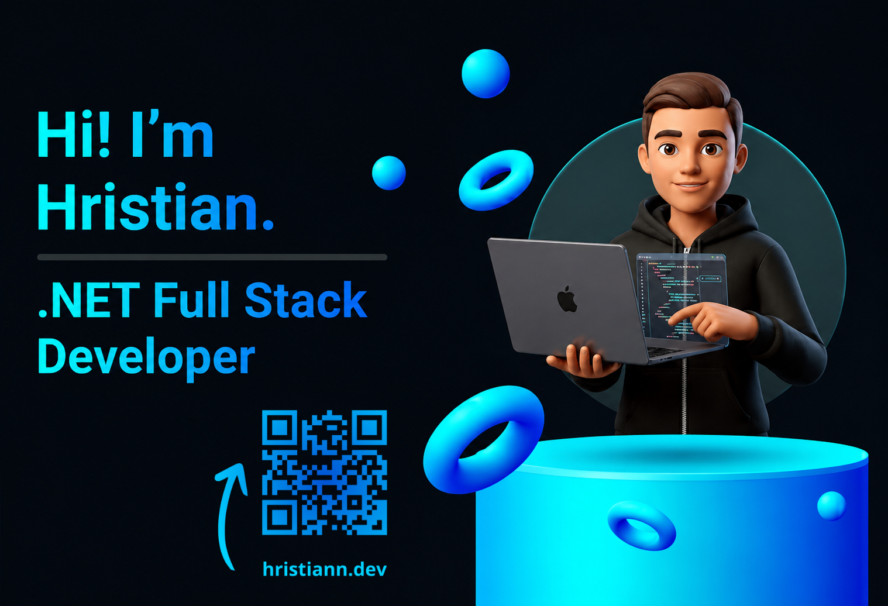

 

<h3 align="center">Hi there 👋, I'm Hristian Nikolov</h3>

  <strong>Junior Full Stack Developer</strong> based in Bulgaria 🇧🇬

  I'm a passionate builder 🛠️ who loves transforming complex logic into clean, elegant applications. 
  An alumnus of Telerik Academy (C# Track) 🎓, deeply rooted in the <strong>.NET ecosystem</strong> 💻, and currently expanding my horizons into <strong>React</strong> ⚛️.

  <em>Eagerly seeking my next challenge in professional software engineering. Rocketing forward 🚀, one commit at a time.</em>

 

 

<h3 align="center">
  &nbsp; Tech Stack
</h3>

 

  

 

 

<h3 align="center">
  &nbsp; GitHub Stats
</h3>

  
  

 

 

<h3 align="center">
  &nbsp; Featured Projects
</h3>

#### 🛠️ Production Deployments
* **[Krezcar.com](https://www.krezcar.com/)** — Full-Scale Commercial Web Application *(Source code available on demand)*

#### 🚀 Individual Repositories
* **[Smart-Garage-V2](https://github.com/Hristian-N/Smart-Garage-V2.git)** `In Development ⏳` — Next-gen auto repair management system built with **Java, Spring Boot & React**.
* **[Java-User-Management-Application](https://github.com/Hristian-N/Java-User-Management-Application.git)** — Secure user administration system featuring robust backend architecture.
* **[React-TODO-app](https://github.com/Hristian-N/React-TODO-app.git)** — Modern, responsive task tracker built to master reactive state management.
* **[Swift-News-App](https://github.com/Hristian-N/Swift-News-App.git)** — Sleek, native iOS mobile news reader utilizing asynchronous API fetching.
* **[CurrencyConversion](https://github.com/Hristian-N/CurrencyConversion.git)** — Lightweight, accurate financial utility app for real-time exchange processing.

#### 👥 Team Projects
* **[Smart-Garage (V1)](https://github.com/A54-Dev-Team-3/Smart-Garage)** — Collaborative MVC architecture platform for auto workshops.
* **[Forum Management System](https://github.com/Dev-team-3-A54-C/Forum_Managment_System)** — Full-featured community hub with secure authentication, post tracking, and user moderation.
* **[Task Management System](https://github.com/Dev-team-3-A54-C/Task_Management_System)** — Agile-inspired project workflow coordinator built with a high-performance database backend.

 

 

<h3 align="center">
   Contact Me
</h3>

 

  &nbsp;&nbsp;
  
  &nbsp;&nbsp;
  

 

  

